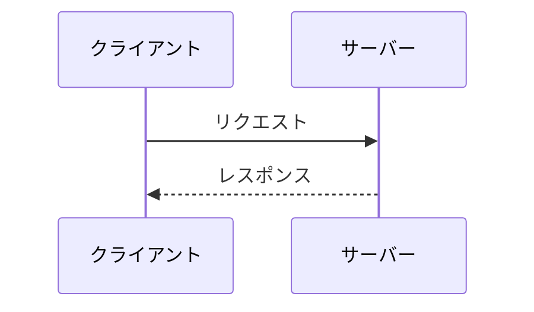
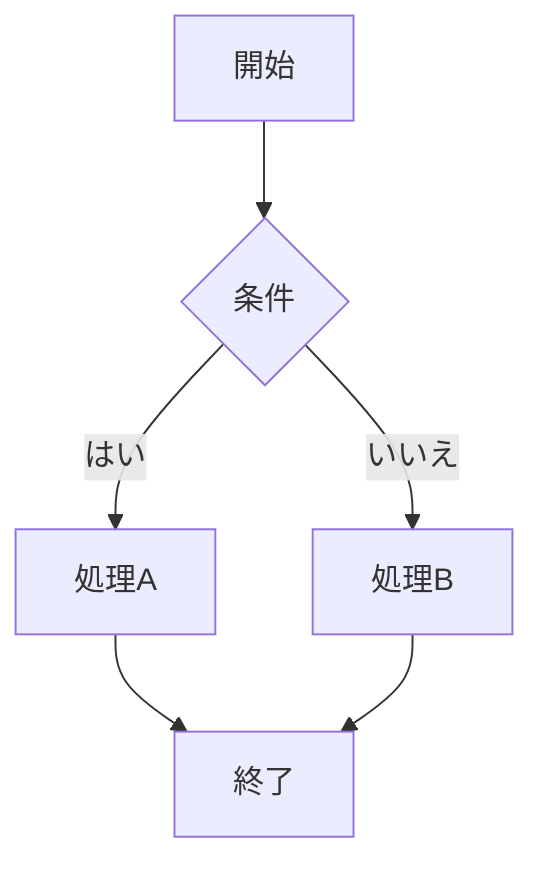

# Marp スライド作成スキル

## 基本方針

### 言葉遣いの原則

**禁止事項**:

- 「アジェンダ」→「本日の内容」「目次」
- 「AI」→「人工知能」（文脈で必要な場合のみ略称可）
- 「フィジカル」→「物理的」「身体的」
- 「ソリューション」→「解決策」「方法」
- 「イシュー」→「課題」「問題」
- 「コミット」（ビジネス文脈）→「取り組む」「責任を持つ」
- 「シナジー」→「相乗効果」
- 「スキーム」→「仕組み」「枠組み」
- 「リソース」→「資源」「人員」「時間」
- 「イノベーション」→「技術革新」「新しい取り組み」
- 「トランスフォーメーション」→「変革」「転換」
- 「ローンチ」→「公開」「開始」
- 「バリュー」→「価値」
- 過度な強調（「超」「めちゃくちゃ」「爆速」）

**技術用語は原語のまま使用可**:
API, HTTP, JSON, Docker, Kubernetes, Git, CI/CD, REST, GraphQL など

### 口調

- 「です・ます」調を基本とする
- 箇条書きは体言止めも可
- 「〜である」「〜だ」は強調したい場面のみ
- 聴衆への呼びかけは控えめに（「皆さん」の多用を避ける）

### 工学的正確性

1. **定義を先に示す**: 専門用語を使う前に定義する
2. **数値には根拠を示す**: 出典・条件を明記
3. **因果関係を明確に**: 「なぜならば」「したがって」で論理をつなぐ
4. **仮定と事実を区別**: 「〜と考えられる」「〜である」を使い分ける

### 引用ルール

```markdown
<!-- 画像の引用 -->


_出典: 著者名 (年). 論文/書籍タイトル_

<!-- 文章の引用 -->

> 引用文
> — 著者名『書籍名』(年)

<!-- 参考文献セクション -->

## 参考文献

1. 著者 (年). **タイトル** - [リンクテキスト](URL)
```

## Marp フロントマター

```yaml
---
marp: true
theme: default
paginate: true
header: 'タイトル'
footer: '年'
math: mathjax
html: true
style: |
  section {
    font-size: 28px;
  }
  .columns {
    display: flex;
    gap: 20px;
  }
  .col {
    flex: 1;
  }
  img[alt~="center"] {
    display: block;
    margin: 0 auto;
  }
---
```

## スライド構成パターン

### タイトルスライド

```markdown
<!-- _class: lead -->
<!-- _paginate: false -->
<!-- _header: '' -->
<!-- _footer: '' -->

# タイトル

## サブタイトル


```

### 目次スライド

```markdown
## 本日の内容

1. **第1章タイトル**
2. **第2章タイトル**
3. **第3章タイトル**
4. **まとめ**
```

### 2カラムレイアウト

```markdown
<div class="columns">
<div class="col">

### 左側の内容

- 項目1
- 項目2

</div>
<div class="col">

### 右側の内容


</div>
</div>
```

### 章区切り

```markdown
---
<!-- _class: lead -->

# 章タイトル

### 補足説明（任意）
---
```

## 視覚要素

### Mermaid図

````markdown





````

### 表

```markdown
| 項目 | 説明 | 備考 |
| ---- | ---- | ---- |
| A    | ...  | ...  |
| B    | ...  | ...  |
```

### 数式

```markdown
<!-- インライン -->

$E = mc^2$

<!-- ブロック -->

$$
\frac{\partial f}{\partial x} = \lim_{h \to 0} \frac{f(x+h) - f(x)}{h}
$$
```

### YouTube埋め込み

```markdown
<iframe width="720" height="405" src="https://www.youtube.com/embed/VIDEO_ID" frameborder="0" allowfullscreen></iframe>
```

### 背景画像

```markdown
<!-- 右側に配置 -->


<!-- 全体背景 -->


<!-- 複数画像 -->


```

## 終了スライド

```markdown
---

<!-- _class: lead -->
<!-- _paginate: false -->
<!-- _header: '' -->
<!-- _footer: '' -->

# ご清聴ありがとうございました

### 質問はありますか？

---
```

## 参考文献セクション

```markdown
## 参考文献

### 論文・書籍

1. 著者 (年). **タイトル** - [リンク](URL)
2. 著者 (年). **タイトル** - 出版社

### 動画・その他

- タイトル: [youtube.com/watch?v=...](URL)
```

## チェックリスト

作成後に確認:

- [ ] カタカナビジネス用語を使っていないか
- [ ] 専門用語は定義してから使っているか
- [ ] 数値の出典・条件は明記されているか
- [ ] 引用元は正しく記載されているか
- [ ] Mermaid図や表を活用しているか
- [ ] 各スライドの情報量は適切か（詰め込みすぎていないか）
