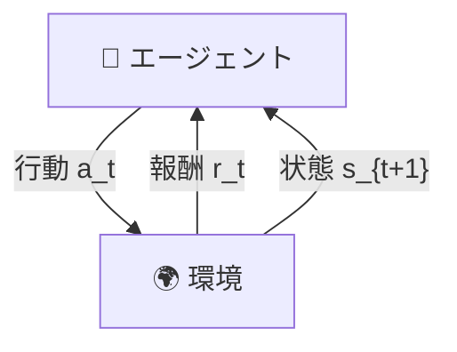
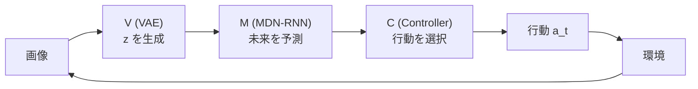
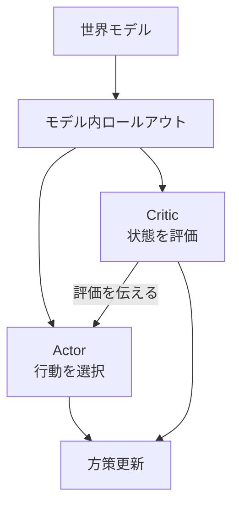

<!-- _class: lead -->
<!-- _paginate: false -->
<!-- _header: '' -->
<!-- _footer: '' -->

# 世界モデル入門

## World Model — 環境モデルを使った効率的な強化学習


---

## 本日の内容

<div class="columns">
<div class="col">

1. **強化学習の基礎**
2. **世界モデルとは**
3. **World Models (2018)**
4. **Dreamer系列**
5. **DayDreamer**
6. **Dreamer 4**
7. **まとめ**

</div>
<div class="col">


_DreamerV3がMinecraftをプレイする様子_

</div>
</div>

---

<!-- _class: lead -->

# 強化学習の基礎

---

## 強化学習（Reinforcement Learning）とは

<div class="columns">
<div class="col">

- **エージェント**が**環境**と相互作用
- **行動**を取り、**報酬**を受け取る
- **目標**: 累積報酬を最大化

### 基本ループ

$$s_t \xrightarrow{\text{行動 } a_t} r_t, s_{t+1}$$

</div>
<div class="col">



</div>
</div>

---

## 従来の強化学習の課題

### サンプル効率の悪さ

| 手法        | 必要なサンプル数 | 学習時間     |
| ----------- | ---------------- | ------------ |
| DQN (Atari) | 数千万フレーム   | 数日〜数週間 |
| PPO         | 数百万ステップ   | 数時間〜数日 |
| **人間**    | 数分〜数時間     | 即座に適応   |

### なぜ効率が悪いのか？

- 試行錯誤に**実環境が必要** → ロボットでは**危険・高コスト**
- 失敗も含めて**全て実行が必要**

→ この効率の差はどこから来るのか？人間の学習を観察してみる

---

## 人間はどう学習するか？

> 「人間は実際に行動する前に、頭の中でシミュレーションしている」
> — K. Craik『The Nature of Explanation』(1943) の考え方に基づく

### 例：自転車に乗る練習

1. **見て学ぶ**（観察）- 他の人が乗っている様子を見る
2. **頭の中でイメージ** - どうすればバランスが取れるか考える
3. **実際に試す**（実行）- 少しずつ練習する
4. **失敗から修正**（学習）- 転んだら次は気をつける

人間は「頭の中の環境モデル」を使って、実際に試す前に結果を予測している。この「頭の中のモデル」を人工知能にも持たせようというのが、次に紹介する2つのアプローチの違いにつながる。

---

## モデルベース vs モデルフリー

<div class="columns">
<div class="col">

### モデルフリー

- 環境を直接経験して学習
- **環境のモデルを持たない**
- シンプルだが非効率
- 例: DQN, PPO, SAC

```
状態 → 行動（直接学習）
```

→ 毎回実環境で試す必要がある

</div>
<div class="col">

### モデルベース（世界モデル）

- 環境の**モデル**を先に学習
- モデル内で**頭の中のシミュレーション**
- 実環境を使わずに学習できる
- **サンプル効率が高い**

```
状態 → モデル → 予測 → 行動
```

→ 人間の「頭の中でイメージ」に相当

</div>
</div>

---

## 世界モデルの基本的な考え方

### 2段階の学習


### なぜこれで効率が上がるのか？

- 実環境でのデータ収集は**コストが高い**（時間・安全性）
- 一度モデルを学習すれば、**モデル内でのシミュレーションはほぼ無料**
- したがって、少ない実データから大量の仮想経験を生成できる

ここから、この考え方を最初に本格的に実現した研究を紹介する。

---

<!-- _class: lead -->

# World Models (2018)

### 世界モデル研究の原点

---

## World Models の概要

<div class="columns">
<div class="col">

### 論文情報

- **著者**: David Ha, Jürgen Schmidhuber
- **年**: 2018
- **成果**: モデル内での学習を実現

### 主なアイデア

- 環境の内部モデルを構築
- モデル内で**シミュレーション**して学習
- 実環境での試行を大幅削減

</div>
<div class="col">


📎 [worldmodels.github.io](https://worldmodels.github.io/)

</div>
</div>

---

## World Models: CarRacing デモ動画

<!-- _class: lead -->

<div style="text-align: center;">

### OpenAI Gym CarRacing-v0 を世界モデルで解く

<iframe width="720" height="405" src="https://www.youtube.com/embed/CAA_a5qtD34" frameborder="0" allow="accelerometer; autoplay; clipboard-write; encrypted-media; gyroscope; picture-in-picture" allowfullscreen></iframe>

</div>

---

## World Models: CarRacing タスク


### OpenAI Gym CarRacing-v0

- 64x64 RGB画像入力
- 連続的なステアリング操作
- **世界モデル内で学習**して実環境で評価

### 結果

- 従来手法を大幅に上回る性能
- 実環境での試行回数を削減

---

## World Models アーキテクチャ

### 3つのコンポーネント

<div class="columns">
<div class="col">


</div>
<div class="col">

| コンポーネント     | 役割                 | モデル     |
| ------------------ | -------------------- | ---------- |
| **V (Vision)**     | 画像を潜在空間に圧縮 | VAE        |
| **M (Memory)**     | 次の状態を予測       | MDN-RNN    |
| **C (Controller)** | 行動を決定           | 線形モデル |

</div>
</div>

この3つは、**見る → 覚える → 動く** に対応している。
まずは「見る」部分、Visionモデルの仕組みから説明する。

---

## なぜ画像をそのまま扱えないのか？

### 画像データの問題

- CarRacingの画像: 64×64ピクセル × 3色 = **12,288次元**
- この高次元データを直接扱うと、計算コストが膨大になる
- さらに、ピクセル単位の変化には**ノイズ**が多い

### 必要なのは「本質的な情報」

- 車の位置、道路の曲がり具合、速度 → **数十個の数値**で表現できるはず
- 画像の「見た目」ではなく「意味」を抽出したい

→ この圧縮を行うのが **VAE（変分オートエンコーダ）**

---

## VAE の基本的な仕組み

<div class="columns">
<div class="col">

### オートエンコーダとは

画像を一度**圧縮**してから**復元**するネットワーク


- 圧縮後の表現 $z$ を**潜在ベクトル**と呼ぶ
- $z$ は画像の「本質的な特徴」を保持する

</div>
<div class="col">

### 復元の例


左: 入力画像、右: 復元画像
→ 本質情報は保持されている

</div>
</div>

---

## 通常のオートエンコーダと VAE の違い

<div class="columns">
<div class="col">

### 通常のオートエンコーダ

- $z$ は**決定的**な値（毎回同じ入力→同じ $z$）
- 潜在空間に「隙間」ができやすい
- 似た画像でも $z$ が離れた位置になることがある

</div>
<div class="col">

### VAE（変分オートエンコーダ）

- $z$ を確率分布として表現:

$$z \sim \mathcal{N}(\mu, \sigma^2)$$

- 「この画像の $z$ は、平均 $\mu$、分散 $\sigma^2$ の正規分布のどこかにある」
- これにより潜在空間が**隙間なく埋まる**

</div>
</div>

### VAEの利点: 潜在空間が「滑らか」になる

- 潜在空間上の**近い点は似た画像**に対応する（連続性）
- 2つの $z$ の間を**滑らかに補間**でき、中間的な画像が生成される
- → 世界モデルでは、**状態の微小な変化を予測しやすくなる**

---

## V から M へ：画像を圧縮した次は予測

### ここまでの流れ

1. V (VAE) が画像を潜在ベクトル $z$ に圧縮した
2. $z$ は画像の本質的な特徴を低次元で表現している

### 次にやりたいこと

- 現在の状態 $z_t$ と行動 $a_t$ から、**次の状態 $z_{t+1}$ を予測**したい
- これができれば、実環境を使わずに「次に何が起こるか」をシミュレーションできる

→ この予測を行うのが **M (Memory)** モデル

---

## MDN-RNN: 未来を予測する

<div class="columns">
<div class="col">

### RNN（再帰型ニューラルネットワーク）

- 過去の情報を**隠れ状態** $h_t$ として記憶
- $h_t$ は「これまでの経験の要約」

### MDN（混合密度ネットワーク）

- 予測を1つの値ではなく**確率分布**として出力

### 予測式: $P(z_{t+1} | a_t, z_t, h_t)$

行動・現在の状態・過去の記憶から、次の状態の確率分布を出力する

</div>
<div class="col">

### なぜ確率的に予測するのか？

同じ状態で同じ行動をしても結果は毎回少し異なる

例: ハンドルを右に切ったとき

- 道路が乾いている → 右に曲がる
- 道路が濡れている → スリップする

→ MDNはこうした**不確実性**を自然に表現できる

</div>
</div>

---

## Controller: V と M を使って行動を決定する

### 3つのコンポーネントの連携



### Controller は非常にシンプル

- 入力: $z_t$（現在の状態）と $h_t$（過去の記憶）
- 出力: 行動 $a_t$
- **線形モデル**: $a_t = W \cdot [z_t, h_t] + b$

賢さは V と M が担い、C は**最終判断だけ**を行う。
パラメータが少ないため、進化戦略で効率的に最適化できる。

---

## World Models: 「夢の中」での学習


### モデル内学習の手順

1. 少量の実環境データで**V と M を学習**
2. 学習済みのMが「仮想環境」になる
3. Controller は**仮想環境だけで学習**
4. 最後に実環境で評価

### VizDoom Take Cover での検証

- FPS風ゲーム: 敵の火の玉を避ける
- 「夢の中」で学習し、実環境でも動作

---

## World Models の限界

### この研究で示されたこと

- 世界モデルを使って環境を学習し、モデル内で方策を改善できる
- シンプルなタスク（CarRacing, VizDoom）で有効性を実証

### 残された課題

| 課題           | 内容                         |
| -------------- | ---------------------------- |
| タスクの複雑さ | 単純なゲームでのみ検証       |
| 学習の安定性   | モデルの誤差が蓄積しやすい   |
| 行動空間       | 連続行動の扱いが限定的       |
| スケーリング   | 大規模な問題への適用が未検証 |

→ これらの課題を解決していったのが **Dreamer系列** の研究

---

<!-- _class: lead -->

# Dreamer系列の進化

### より強力な世界モデルへ

---

## World Models から Dreamer へ：何が変わったか

<div class="columns">
<div class="col">

### World Models の学習方法

1. V, M を学習（教師あり学習）
2. C を**進化戦略**で最適化
3. 各ステップが独立

**問題**: 進化戦略はパラメータが少ないモデルでしか使えない → 複雑なタスクに対応できない

</div>
<div class="col">

### Dreamer の学習方法

1. 世界モデルを学習
2. モデル内で**勾配を逆伝播**して方策を改善
3. **Actor-Critic**で行動を学習

**利点**: 勾配ベースの学習により、大規模で複雑なタスクにも対応可能

</div>
</div>

---

## Dreamer のしくみ: Actor-Critic とは

<div class="columns">
<div class="col">

### Actor（行動者）

- 状態を見て**行動を選択**する

### Critic（評価者）

- ある状態が**どれだけ良いかを評価**する

### 学習の流れ

1. Criticが状態を評価
2. Actorがその評価をもとに行動を改善

</div>
<div class="col">



World Modelsの線形Controller と異なり、Actor-Criticは**複雑な行動戦略**を学習できる

</div>
</div>

---

## Dreamer系列の進化


| バージョン    | 年   | 主な改善           |
| ------------- | ---- | ------------------ |
| **DreamerV1** | 2020 | 基本アーキテクチャ |
| **DreamerV2** | 2021 | 離散潜在空間       |
| **DreamerV3** | 2023 | スケーリング       |
| **Dreamer 4** | 2025 | 大規模化           |

### 共通の考え方

> **「モデル内で学習し、実環境で実行」**

World Models と同じ基本思想だが、各世代で学習方法やモデル構造を改善していった。

---

## DreamerV3: 汎用的な世界モデル

<div class="columns">
<div class="col">

### 成果

- **150以上**のタスクで検証
- **固定ハイパラ**で汎用的に動作
- Minecraftでダイヤモンド発見

### スケーリング特性

モデルサイズを大きくすると：

- 性能向上
- データ効率も向上

</div>
<div class="col">


_スケーリングによる性能向上_

</div>
</div>

---

## モデル内学習（Imagination Training）の全体像

### 学習サイクル


### なぜ効率的か？

| 項目           | モデルフリー | Dreamer    |
| -------------- | ------------ | ---------- |
| 実環境ステップ | 多い         | **少ない** |
| 安全性         | 低い         | **高い**   |
| 適応速度       | 遅い         | **速い**   |

→ ここまではシミュレーション環境での実験。**実ロボット**にも適用できるか？

---

<!-- _class: lead -->

# DayDreamer

### 実世界ロボットへの応用

---

## なぜ実ロボットへの適用が難しいのか？

### シミュレーションと実世界の違い

| 項目       | シミュレーション | 実世界             |
| ---------- | ---------------- | ------------------ |
| データ収集 | 高速・並列       | 低速・逐次         |
| リセット   | 瞬時             | 手動で必要         |
| 安全性     | 壊れない         | 破損のリスク       |
| 観測       | 完全・ノイズなし | 不完全・ノイズあり |

### 従来の方法: Sim-to-Real

1. シミュレータ内で学習 → 2. 実ロボットに転移

**問題**: sim-to-real gap（シミュレータと実世界の差）でうまく動かないことが多い

→ DayDreamer は**シミュレータなしで直接実世界で世界モデルを学習**する

---

## DayDreamer: 実世界ロボットへ

<div class="columns">
<div class="col">

### 論文情報

- **著者**: Wu, Escontrela, Hafner, et al.
- **会議**: CoRL 2022
- **成果**: **1時間**で四脚歩行を学習

### 革新性

- **シミュレータ不要**
- 直接**実世界で学習**
- 安全かつ高速

</div>
<div class="col">


📎 [arXiv:2206.14176](https://arxiv.org/abs/2206.14176)

</div>
</div>

---

## DayDreamer はなぜ実世界で動くのか

### 世界モデルの効率性がカギ


1. 実ロボットで**少量のデータ**を集める（数分間）
2. そのデータで**世界モデルを更新**する
3. モデル内で**大量にシミュレーション**して方策を改善する
4. 改善した方策で再び実ロボットを動かす

→ 実環境での試行は最小限で済む。壊れる前にモデル内で「練習」できる。

---

## DayDreamer: デモ動画

<!-- _class: lead -->

<div style="text-align: center;">

### 1時間で歩行を学習

<iframe width="720" height="405" src="https://www.youtube.com/embed/xAXvfVTgqr0" frameborder="0" allow="accelerometer; autoplay; clipboard-write; encrypted-media; gyroscope; picture-in-picture" allowfullscreen></iframe>

</div>

---

## 四脚ロボット実験の詳細

<div class="columns">
<div class="col">

### 実験設定

- ロボット: **Unitree A1**
- タスク: 歩行学習
- 学習時間: **約1時間**
- リセット操作なし

### 学習の流れ

1. 仰向けから起き上がる
2. 立ち上がる
3. 歩行する

</div>
<div class="col">

### 結果比較

| 指標         | DayDreamer | 従来手法     |
| ------------ | ---------- | ------------ |
| 学習時間     | **1時間**  | 数日〜数週間 |
| シミュレータ | **不要**   | 必要         |
| 適応性       | **高い**   | 低い         |

**押されても10分で適応！**

</div>
</div>

---

## DayDreamer: 様々なロボットで検証

<div class="columns">
<div class="col">

### 四脚ロボット

- 歩行学習
- 外乱への適応

### ロボットアーム

- カメラ画像から物体把持
- スパース報酬で学習

</div>
<div class="col">

### 車輪ロボット

- カメラのみでナビゲーション
- ゴール位置への移動

### 共通点

**すべてシミュレータなしで学習成功**

</div>
</div>

DayDreamerにより、世界モデルが実ロボットでも有効であることが示された。
次に紹介するDreamer 4 では、さらに大きなスケールでの挑戦が行われる。

---

<!-- _class: lead -->

# Dreamer 4 (2025)

### 最新の世界モデル

---

## Dreamer 4 の概要

<div class="columns">
<div class="col">

### 論文情報

- **著者**: Hafner, Yan, Lillicrap
- **年**: 2025
- **成果**: Minecraftでダイヤモンド取得

### 特徴

- **スケーラブル**な世界モデル
- **オフラインデータ**のみで学習
- **リアルタイム**対話型推論

</div>
<div class="col">


📎 [arXiv:2509.24527](https://arxiv.org/abs/2509.24527)

</div>
</div>

---

## Dreamer 4 の新しい点: オフライン学習

### これまでの Dreamer（オンライン学習）


エージェント自身が環境と対話しながら学習 → **環境へのアクセスが必要**

### Dreamer 4（オフライン学習）


すでにある**人間のプレイ動画だけ**から世界モデルを学習し、その中でRLを行う。
環境に一度もアクセスせずに行動方策を獲得できる。

---

## Dreamer 4: デモ動画

<!-- _class: lead -->

<div style="text-align: center;">

### Minecraftでダイヤモンド取得

<iframe width="720" height="405" src="https://www.youtube.com/embed/oDlBtTcX0g0" frameborder="0" allow="accelerometer; autoplay; clipboard-write; encrypted-media; gyroscope; picture-in-picture" allowfullscreen></iframe>

</div>

---

## Minecraft ダイヤモンド取得

### タスクの難しさ


- **20,000以上**のアクション列が必要
- 長期的な計画が必要
- 複雑なクラフティングシステム

---

## Dreamer 4 vs 他手法

<div class="columns">
<div class="col">

### Dreamer 4の成果

- **オフラインデータのみ**から学習
- 環境とのインタラクションなし
- OpenAI VPTを**100分の1のデータ**で上回る

</div>
<div class="col">

### 比較

| 手法          | データ量 | 成功率 |
| ------------- | -------- | ------ |
| OpenAI VPT    | 100x     | 低     |
| GROOT         | 10x      | 中     |
| **Dreamer 4** | **1x**   | **高** |

</div>
</div>

### なぜ少ないデータで高い性能を出せるのか？

- 世界モデルが環境の物理法則を学習している
- そのモデル内で**大量のシミュレーション**が可能
- データからの学習効率が根本的に高い

---

## Dreamer 4: 技術的ブレークスルー

<div class="columns">
<div class="col">

### 1. スケーリング

- より大きなモデル
- より多くのデータ
- より長い予測ホライズン

### 2. オフライン学習

人間のプレイデータ → 世界モデル → モデル内RL

</div>
<div class="col">

### 3. リアルタイム推論

- 対話的なゲームプレイ
- 人間のような応答速度
- **単一GPUで動作**

### 4. 物体相互作用

- 複雑な物理を正確に予測
- ロボティクスへの応用も期待

</div>
</div>

---

<!-- _class: lead -->

# まとめと今後の展望

---

## 世界モデルの進化まとめ


| 手法             | 年      | 主な成果       |
| ---------------- | ------- | -------------- |
| **World Models** | 2018    | 概念実証       |
| **DreamerV1-V3** | 2020-23 | 汎用性向上     |
| **DayDreamer**   | 2022    | **実ロボット** |
| **Dreamer 4**    | 2025    | オフライン学習 |

### 共通する基本的な考え方

> **環境のモデルを学習し、その中でシミュレーションして効率的に学習する**

---

## 今後の展望

<div class="columns">
<div class="col">

### 技術的課題

- より正確な**長期予測**
- **複数モダリティ（視覚・言語）** 対応
- **常識的知識**の統合
- 計算効率の改善

</div>
<div class="col">

### 応用分野

- **自動運転**: 安全なシミュレーション
- **産業用ロボット**: 少ないデータで学習
- **医療ロボット**: 手術支援
- **ゲーム人工知能**: 複雑な戦略

</div>
</div>

### 大規模言語モデルとの融合

**Foundation World Models**: 視覚・言語・行動の統合

---

## 参考文献

### 主要論文

1. Ha & Schmidhuber (2018). **World Models** - [worldmodels.github.io](https://worldmodels.github.io/)
2. Hafner et al. (2020-2023). **Dreamer V1-V3** - ICLR/arXiv
3. Wu et al. (2022). **DayDreamer** - [arXiv:2206.14176](https://arxiv.org/abs/2206.14176)
4. Hafner et al. (2025). **Dreamer 4** - [arXiv:2509.24527](https://arxiv.org/abs/2509.24527)

### デモ動画

- DayDreamer: [youtube.com/watch?v=xAXvfVTgqr0](https://www.youtube.com/watch?v=xAXvfVTgqr0)
- Dreamer 4: [youtube.com/watch?v=oDlBtTcX0g0](https://www.youtube.com/watch?v=oDlBtTcX0g0)

---

<!-- _class: lead -->
<!-- _paginate: false -->
<!-- _header: '' -->
<!-- _footer: '' -->

# ご清聴ありがとうございました

### 質問はありますか？


