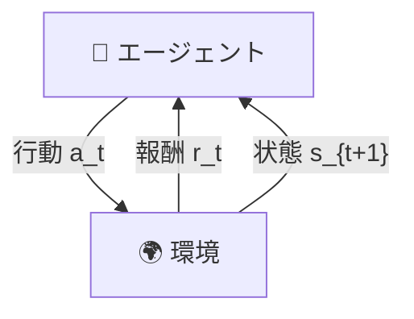
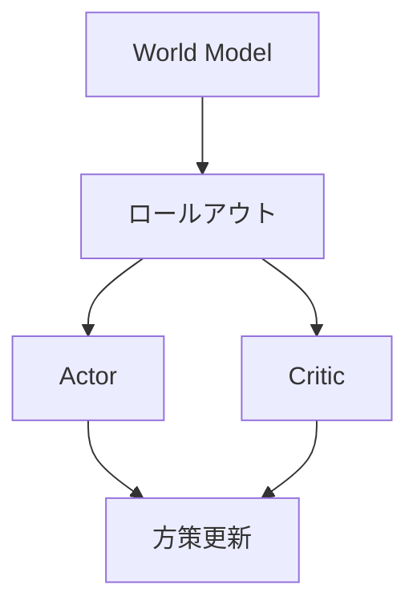

<!-- _class: lead -->
<!-- _paginate: false -->
<!-- _header: '' -->
<!-- _footer: '' -->

# 世界モデル（World Model）入門

## 環境モデルを使った効率的な強化学習


---

## 本日の内容

<div class="columns">
<div class="col">

1. **強化学習の基礎**
2. **世界モデルとは**
3. **World Models (2018)**
4. **Dreamer系列**
5. **DayDreamer**
6. **Dreamer 4**
7. **まとめ**

</div>
<div class="col">


_DreamerV3がMinecraftをプレイする様子_

</div>
</div>

---

<!-- _class: lead -->

# 強化学習の基礎

---

## 強化学習（Reinforcement Learning）とは

<div class="columns">
<div class="col">

- **エージェント**が**環境**と相互作用
- **行動**を取り、**報酬**を受け取る
- **目標**: 累積報酬を最大化

### 基本ループ

$$s_t \xrightarrow{\text{行動 } a_t} r_t, s_{t+1}$$

</div>
<div class="col">



</div>
</div>

---

## 従来の強化学習の課題

### サンプル効率の悪さ

| 手法        | 必要なサンプル数 | 学習時間     |
| ----------- | ---------------- | ------------ |
| DQN (Atari) | 数千万フレーム   | 数日〜数週間 |
| PPO         | 数百万ステップ   | 数時間〜数日 |
| **人間**    | 数分〜数時間     | 即座に適応   |

### なぜ効率が悪いのか？

- 試行錯誤に**実環境が必要** → ロボットでは**危険・高コスト**
- 失敗も含めて**全て実行が必要**

---

## モデルベース vs モデルフリー

<div class="columns">
<div class="col">

### モデルフリー

- 環境を直接経験して学習
- シンプルだが非効率
- 例: DQN, PPO, SAC

```
状態 → 行動（直接学習）
```

</div>
<div class="col">

### モデルベース（世界モデル）

- 環境の**モデル**を学習
- モデル内でシミュレーション
- **サンプル効率が高い**

```
状態 → モデル → 予測 → 行動
```

</div>
</div>

---

## 人間はどう学習するか？

<!-- _class: lead -->

> 「人間は実際に行動する前に、頭の中でシミュレーションしている」
> — K. Craik『The Nature of Explanation』(1943) の考え方に基づく

### 例：自転車に乗る練習

1. **見て学ぶ**（観察）- 他の人が乗っている様子を見る
2. **頭の中でイメージ** - どうすればバランスが取れるか考える
3. **実際に試す**（実行）- 少しずつ練習する
4. **失敗から修正**（学習）- 転んだら次は気をつける

### 世界モデル = 人工知能に環境の予測能力を与える

---

<!-- _class: lead -->

# World Models (2018)

### 世界モデル研究の原点

---

## World Models の概要

<div class="columns">
<div class="col">

### 論文情報

- **著者**: David Ha, Jürgen Schmidhuber
- **年**: 2018
- **成果**: モデル内での学習を実現

### 主なアイデア

- 環境の内部モデルを構築
- モデル内で**シミュレーション**して学習
- 実環境での試行を大幅削減

</div>
<div class="col">


📎 [worldmodels.github.io](https://worldmodels.github.io/)

</div>
</div>

---

## World Models: CarRacing タスク


### OpenAI Gym CarRacing-v0

- 64x64 RGB画像入力
- 連続的なステアリング操作
- **世界モデル内で学習**して実環境で評価

### 結果

- 従来手法を大幅に上回る性能
- 実環境での試行回数を削減

---

## World Models アーキテクチャ

### 3つのコンポーネント

<div class="columns">
<div class="col">


</div>
<div class="col">

| コンポーネント     | 役割                 | モデル     |
| ------------------ | -------------------- | ---------- |
| **V (Vision)**     | 画像を潜在空間に圧縮 | VAE        |
| **M (Memory)**     | 次の状態を予測       | MDN-RNN    |
| **C (Controller)** | 行動を決定           | 線形モデル |

</div>
</div>

---

## VAE: 画像を圧縮して理解する

<div class="columns">
<div class="col">

### 変分オートエンコーダ

$$z \sim \mathcal{N}(\mu, \sigma^2)$$

- 高次元の画像 → 低次元の潜在ベクトル $z$
- **連続的**な潜在空間
- 滑らかな**補間**が可能

</div>
<div class="col">


</div>
</div>

---

## MDN-RNN: 未来を予測する

<div class="columns">
<div class="col">

### Mixture Density Network + RNN

$$P(z_{t+1} | a_t, z_t, h_t)$$

- **RNN**: 時系列情報を記憶
- **MDN**: 確率的な予測を出力
- **不確実性**をモデル化

</div>
<div class="col">

### モデル内での学習

1. MDN-RNNが仮想環境を生成
2. Controllerはこの中で学習
3. 実環境なしで方策改善

```
データ収集 → モデル学習 → シミュレーション → 実行
```

</div>
</div>

---

## World Models: VizDoom での実験


### VizDoom Take Cover

- **FPS風ゲーム環境**
- 敵の火の玉を避ける
- 世界モデル内で学習

### 「夢の中」での学習

モデルが生成した仮想環境のみで学習し、実環境に転移

---

<!-- _class: lead -->

# Dreamer系列の進化

### より強力な世界モデルへ

---

## Dreamerの登場

### DreamerV1 (2020) - モデル内での学習

<div class="columns">
<div class="col">

#### 主な改善点

- 潜在空間での行動学習
- **Actor-Critic**導入
- 連続行動空間対応

#### World Modelsとの違い

- より効率的な勾配計算
- 複雑なタスクに対応
- 汎用性向上

</div>
<div class="col">



</div>
</div>

---

## Dreamer系列の進化


| バージョン    | 年   | 主な改善           |
| ------------- | ---- | ------------------ |
| **DreamerV1** | 2020 | 基本アーキテクチャ |
| **DreamerV2** | 2021 | 離散潜在空間       |
| **DreamerV3** | 2023 | スケーリング       |
| **Dreamer 4** | 2025 | 大規模化           |

### 共通の考え方

> **「モデル内で学習し、実環境で実行」**

---

## DreamerV3: Minecraftで生存

<div class="columns">
<div class="col">

### 成果

- **150以上**のタスクで検証
- **固定ハイパラ**で汎用的に動作
- Minecraftでダイヤモンド発見

### スケーリング特性

モデルサイズを大きくすると：

- 性能向上
- データ効率も向上

</div>
<div class="col">


_スケーリングによる性能向上_

</div>
</div>

---

## モデル内学習（Imagination Training）

### 学習サイクル


### なぜ効率的か？

| 項目           | モデルフリー | Dreamer    |
| -------------- | ------------ | ---------- |
| 実環境ステップ | 多い         | **少ない** |
| 安全性         | 低い         | **高い**   |
| 適応速度       | 遅い         | **速い**   |

---

<!-- _class: lead -->

# DayDreamer

### 実世界ロボットへの応用

---

## DayDreamer: 実世界ロボットへ

<div class="columns">
<div class="col">

### 論文情報

- **著者**: Wu, Escontrela, Hafner, et al.
- **会議**: CoRL 2022
- **成果**: **1時間**で四脚歩行を学習

### 革新性

- **シミュレータ不要**
- 直接**実世界で学習**
- 安全かつ高速

</div>
<div class="col">


📎 [arXiv:2206.14176](https://arxiv.org/abs/2206.14176)

</div>
</div>

---

## DayDreamer: デモ動画

<!-- _class: lead -->

<div style="text-align: center;">

### 1時間で歩行を学習

<iframe width="720" height="405" src="https://www.youtube.com/embed/xAXvfVTgqr0" frameborder="0" allow="accelerometer; autoplay; clipboard-write; encrypted-media; gyroscope; picture-in-picture" allowfullscreen></iframe>

</div>

---

## 四脚ロボット実験の詳細

<div class="columns">
<div class="col">

### 実験設定

- ロボット: **Unitree A1**
- タスク: 歩行学習
- 学習時間: **約1時間**
- リセット操作なし

### 学習の流れ

1. 仰向けから起き上がる
2. 立ち上がる
3. 歩行する

</div>
<div class="col">

### 結果比較

| 指標         | DayDreamer | 従来手法     |
| ------------ | ---------- | ------------ |
| 学習時間     | **1時間**  | 数日〜数週間 |
| シミュレータ | **不要**   | 必要         |
| 適応性       | **高い**   | 低い         |

**押されても10分で適応！**

</div>
</div>

---

## DayDreamer: 様々なロボットで検証

<div class="columns">
<div class="col">

### 四脚ロボット

- 歩行学習
- 外乱への適応

### ロボットアーム

- カメラ画像から物体把持
- スパース報酬で学習

</div>
<div class="col">

### 車輪ロボット

- カメラのみでナビゲーション
- ゴール位置への移動

### 共通点

**すべてシミュレータなしで学習成功**

</div>
</div>

---

<!-- _class: lead -->

# Dreamer 4 (2025)

### 最新の世界モデル

---

## Dreamer 4 の概要

<div class="columns">
<div class="col">

### 論文情報

- **著者**: Hafner, Yan, Lillicrap
- **年**: 2025
- **成果**: Minecraftでダイヤモンド取得

### 特徴

- **スケーラブル**な世界モデル
- **オフラインデータ**のみで学習
- **リアルタイム**対話型推論

</div>
<div class="col">


📎 [arXiv:2509.24527](https://arxiv.org/abs/2509.24527)

</div>
</div>

---

## Dreamer 4: デモ動画

<!-- _class: lead -->

<div style="text-align: center;">

### Minecraftでダイヤモンド取得

<iframe width="720" height="405" src="https://www.youtube.com/embed/oDlBtTcX0g0" frameborder="0" allow="accelerometer; autoplay; clipboard-write; encrypted-media; gyroscope; picture-in-picture" allowfullscreen></iframe>

</div>

---

## Minecraft ダイヤモンド取得

### タスクの難しさ


- **20,000以上**のアクション列が必要
- 長期的な計画が必要
- 複雑なクラフティングシステム

---

## Dreamer 4 vs 他手法

<div class="columns">
<div class="col">

### Dreamer 4の成果

- **オフラインデータのみ**から学習
- 環境とのインタラクションなし
- OpenAI VPTを**100分の1のデータ**で上回る

</div>
<div class="col">

### 比較

| 手法          | データ量 | 成功率 |
| ------------- | -------- | ------ |
| OpenAI VPT    | 100x     | 低     |
| GROOT         | 10x      | 中     |
| **Dreamer 4** | **1x**   | **高** |

</div>
</div>

---

## Dreamer 4: 技術的ブレークスルー

<div class="columns">
<div class="col">

### 1. スケーリング

- より大きなモデル
- より多くのデータ
- より長い予測ホライズン

### 2. オフライン学習

人間のプレイデータ → 世界モデル → モデル内RL

</div>
<div class="col">

### 3. リアルタイム推論

- 対話的なゲームプレイ
- 人間のような応答速度
- **単一GPUで動作**

### 4. 物体相互作用

- 複雑な物理を正確に予測
- ロボティクスへの応用も期待

</div>
</div>

---

<!-- _class: lead -->

# まとめと今後の展望

---

## 世界モデルの進化まとめ


| 手法             | 年      | 主な成果       |
| ---------------- | ------- | -------------- |
| **World Models** | 2018    | 概念実証       |
| **DreamerV1-V3** | 2020-23 | 汎用性向上     |
| **DayDreamer**   | 2022    | **実ロボット** |
| **Dreamer 4**    | 2025    | オフライン学習 |

### 共通する基本的な考え方

> **環境モデルを活用した効率的な学習**

---

## 今後の展望

<div class="columns">
<div class="col">

### 技術的課題

- より正確な**長期予測**
- **複数モダリティ（視覚・言語）** 対応
- **常識的知識**の統合
- 計算効率の改善

</div>
<div class="col">

### 応用分野

- **自動運転**: 安全なシミュレーション
- **産業用ロボット**: 少ないデータで学習
- **医療ロボット**: 手術支援
- **ゲーム人工知能**: 複雑な戦略

</div>
</div>

### 大規模言語モデルとの融合

**Foundation World Models**: 視覚・言語・行動の統合

---

## 参考文献

### 主要論文

1. Ha & Schmidhuber (2018). **World Models** - [worldmodels.github.io](https://worldmodels.github.io/)
2. Hafner et al. (2020-2023). **Dreamer V1-V3** - ICLR/arXiv
3. Wu et al. (2022). **DayDreamer** - [arXiv:2206.14176](https://arxiv.org/abs/2206.14176)
4. Hafner et al. (2025). **Dreamer 4** - [arXiv:2509.24527](https://arxiv.org/abs/2509.24527)

### デモ動画

- DayDreamer: [youtube.com/watch?v=xAXvfVTgqr0](https://www.youtube.com/watch?v=xAXvfVTgqr0)
- Dreamer 4: [youtube.com/watch?v=oDlBtTcX0g0](https://www.youtube.com/watch?v=oDlBtTcX0g0)

---

<!-- _class: lead -->
<!-- _paginate: false -->
<!-- _header: '' -->
<!-- _footer: '' -->

# ご清聴ありがとうございました

### 質問はありますか？


