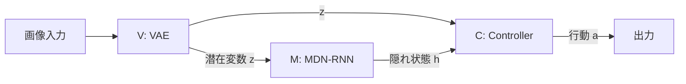
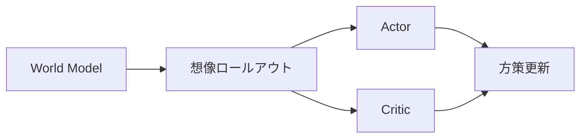
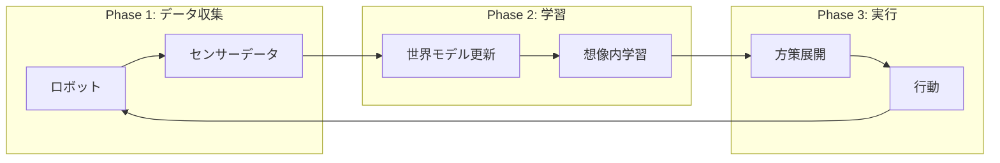

<!-- _class: lead -->
<!-- _paginate: false -->
<!-- _header: '' -->
<!-- _footer: '' -->

# 世界モデル（World Model）入門

## ロボットが「想像」で学ぶ時代

---

## 本日のアジェンダ

1. **強化学習の基礎** - エージェントと環境
2. **世界モデルとは** - 想像力を持つAI
3. **World Models (2018)** - 原点となる論文
4. **Dreamer系列** - 想像内学習の進化
5. **DayDreamer** - 実世界ロボットへの応用
6. **Dreamer 4** - 最新の成果
7. **まとめと展望** - 今後の可能性

---

<!-- _class: lead -->

# セクション1

## 強化学習の基礎

---

## 強化学習（Reinforcement Learning）とは


- **エージェント**が**環境**と相互作用して**行動**を取り、**報酬**を受け取る
- **目標**: 累積報酬を最大化
- **基本ループ**: 状態 $s_t$ → 行動 $a_t$ → 報酬 $r_t$ → 次の状態 $s_{t+1}$

---

## 従来の強化学習の課題

### Sample Inefficiency（サンプル効率の悪さ）

| 手法        | 必要なサンプル数 | 学習時間     |
| ----------- | ---------------- | ------------ |
| DQN (Atari) | 数千万フレーム   | 数日〜数週間 |
| PPO         | 数百万ステップ   | 数時間〜数日 |
| 人間        | 数分〜数時間     | 即座に適応   |

### なぜ効率が悪いのか？

- 試行錯誤に**実環境が必要**
- 失敗も含めて**全て実行が必要**
- ロボットでは**危険・高コスト**

---

## モデルベース vs モデルフリー

<div style="display: flex;">
<div style="flex: 1; padding-right: 20px;">

### モデルフリー

- 環境を直接経験して学習
- シンプルだが非効率
- 例: DQN, PPO, SAC

```
状態 → 行動（直接学習）
```

</div>
<div style="flex: 1; padding-left: 20px;">

### モデルベース

- 環境の**モデル**を学習
- モデル内でシミュレーション
- **世界モデル**はここに属する

```
状態 → モデル → 予測 → 行動
```

</div>
</div>

---

## 人間はどう学習するか？

<!-- _class: lead -->

> 「人間は実際に行動する前に、頭の中でシミュレーションしている」

### 例：自転車に乗る練習

1. **見て学ぶ**（観察）- 他の人が乗っている様子を見る
2. **頭の中でイメージ**（想像）- どうすればバランスが取れるか考える
3. **実際に試す**（実行）- 少しずつ練習する
4. **失敗から修正**（学習）- 転んだら次は気をつける

### 世界モデル = AIに「想像力」を与える

---

<!-- _class: lead -->

# セクション2

## World Models (2018)

---

## World Models の概要

<div style="display: flex; align-items: center;">
<div style="flex: 1;">

### 論文情報

- **著者**: David Ha, Jürgen Schmidhuber
- **年**: 2018
- **成果**: 「夢の中で学習」を実現

### 革新的なアイデア

- 環境の「メンタルモデル」を構築
- モデル内で**夢を見るように**学習
- 実環境での試行を大幅削減

</div>
<div style="flex: 1; text-align: center;">

**論文サイト**
[worldmodels.github.io](https://worldmodels.github.io/)


</div>
</div>

---

## World Models アーキテクチャ

### 3つのコンポーネント



| コンポーネント     | 役割                 | モデル     |
| ------------------ | -------------------- | ---------- |
| **V (Vision)**     | 画像を潜在空間に圧縮 | VAE        |
| **M (Memory)**     | 次の状態を予測       | MDN-RNN    |
| **C (Controller)** | 行動を決定           | 線形モデル |

---

## VAE（変分オートエンコーダ）の役割

### Vision Model: 世界を「見る」


- **機能**: 高次元の画像 → 低次元の潜在ベクトル $z$（情報の**圧縮と抽出**）
- **なぜVAEか？**: **連続的**な潜在空間、**生成モデル**としても機能、滑らかな**補間**が可能

$$z \sim \mathcal{N}(\mu, \sigma^2)$$

---

## MDN-RNN の役割

### Memory Model: 未来を「予測」する

<div style="display: flex;">
<div style="flex: 1;">

#### Mixture Density Network + RNN

$$P(z_{t+1} | a_t, z_t, h_t)$$

- **RNN**: 時系列情報を記憶
- **MDN**: 確率的な予測を出力
- **不確実性**をモデル化

</div>
<div style="flex: 1;">

#### 「夢」の中での学習

1. MDN-RNNが仮想環境を生成
2. Controllerはこの中で学習
3. 実環境なしで方策改善

```
現実 → 学習 → 夢 → 学習 → 現実
```

</div>
</div>

---

<!-- _class: lead -->

# セクション3

## Dreamer系列の進化

---

## Dreamerの登場

### DreamerV1 (2020) - 想像の中で学ぶ



- **主な改善点**: 潜在空間での行動学習、Actor-Critic導入、連続行動空間対応
- **World Modelsとの違い**: より効率的な勾配計算、複雑なタスクに対応、汎用性向上

---

## Dreamer系列の進化

| バージョン    | 年   | 主な改善           | 成果             |
| ------------- | ---- | ------------------ | ---------------- |
| **DreamerV1** | 2020 | 基本アーキテクチャ | DMC ベンチマーク |
| **DreamerV2** | 2021 | 離散潜在空間       | Atari 200ゲーム  |
| **DreamerV3** | 2023 | スケーリング       | Minecraft生存    |
| **Dreamer 4** | 2025 | 大規模化           | Minecraftダイヤ  |

### 共通の思想

> **「想像の中で学習し、現実で実行」**

---

## Imagination Training（想像内学習）

### プロセス


### 詳細ステップ

1. **世界モデル**で未来を予測（ロールアウト）
2. 予測した軌跡で**報酬を計算**
3. **Actor-Critic**を更新
4. 実環境で**少数のデータ収集**
5. **世界モデル**を更新

---

## なぜDreamerは効率的か？

### 計算 vs 実行のトレードオフ

| 項目           | モデルフリー | Dreamer    |
| -------------- | ------------ | ---------- |
| 実環境ステップ | 多い         | **少ない** |
| 計算量         | 少ない       | 多い       |
| 安全性         | 低い         | **高い**   |
| 転移性         | 低い         | **高い**   |
| 適応速度       | 遅い         | **速い**   |

### GPUでの「夢見」

- 1回の実環境ステップ → **数千回の想像内ステップ**
- 失敗しても現実には影響なし
- 危険な行動も安全に試せる

---

<!-- _class: lead -->

# セクション4

## DayDreamer

---

## DayDreamer: 実世界ロボットへ

<div style="display: flex; align-items: center;">
<div style="flex: 1;">

### 論文情報

- **著者**: Wu, Escontrela, Hafner, Goldberg, Abbeel
- **会議**: CoRL 2022
- **成果**: **1時間**で四脚歩行を学習

### 革新性

- **シミュレータ不要**
- 直接**実世界で学習**
- 安全かつ高速

</div>
<div style="flex: 1; text-align: center;">

**論文**
[arXiv:2206.14176](https://arxiv.org/abs/2206.14176)


</div>
</div>

---

## DayDreamer システム構成

### 3つのフェーズ



### 特徴

- **オンライン**でモデル更新
- **低頻度**の実環境インタラクション
- **高頻度**の想像内学習

---

## 四脚ロボット実験

### Unitree A1 での実験

<div style="display: flex;">
<div style="flex: 1;">

#### 実験設定

- ロボット: **Unitree A1**
- タスク: 歩行学習
- 学習時間: **約1時間**
- リセットなし

#### 学習内容

1. 仰向けから起き上がる
2. 立ち上がる
3. 歩行する

</div>
<div style="flex: 1;">

#### 結果

| 指標         | DayDreamer | 従来手法     |
| ------------ | ---------- | ------------ |
| 学習時間     | **1時間**  | 数日〜数週間 |
| シミュレータ | **不要**   | 必要         |
| 適応性       | **高い**   | 低い         |

押されても**10分で適応**

</div>
</div>

---

## DayDreamer: デモ動画

<!-- _class: lead -->

### YouTube: 1時間で歩行を学習

<div style="text-align: center; font-size: 1.2em;">

**[動画を見る: Learning to Walk in the Real World in 1 Hour](https://www.youtube.com/watch?v=xAXvfVTgqr0)**

</div>

### 動画の内容

- 最初は転倒を繰り返す
- 徐々にバランスを学習
- 1時間後には安定して歩行

> シミュレータなし、実世界で直接学習

---

<!-- _class: lead -->

# セクション5

## Dreamer 4 (最新)

---

## Dreamer 4 の概要

<div style="display: flex; align-items: center;">
<div style="flex: 1;">

### 論文情報

- **著者**: Hafner, Yan, Lillicrap
- **年**: 2025
- **成果**: Minecraftでダイヤモンド取得

### 特徴

- **スケーラブル**な世界モデル
- **オフラインデータ**のみで学習
- **リアルタイム**対話型推論

</div>
<div style="flex: 1; text-align: center;">

**論文**
[arXiv:2509.24527](https://arxiv.org/abs/2509.24527)


</div>
</div>

---

## Minecraft ダイヤモンド取得

### タスクの難しさ


- **20,000以上**のアクション列
- 長期的な計画が必要
- 複雑なクラフティングシステム

### Dreamer 4の成果

- **オフラインデータのみ**から学習（環境とのインタラクションなし）
- OpenAI VPTを**100分の1のデータ**で上回る

---

## Dreamer 4: デモ動画

<!-- _class: lead -->

### YouTube: Minecraftでダイヤモンド取得

<div style="text-align: center; font-size: 1.2em;">

**[動画を見る: Dreamer 4 | Diamonds from Offline Experience](https://www.youtube.com/watch?v=oDlBtTcX0g0)**

</div>

### 動画の内容

- オフライン学習したエージェント
- 実際のMinecraft環境で評価
- ダイヤモンドまでの全工程を達成

---

## Dreamer 4: 技術的ブレークスルー

### 3つの革新

<div style="display: flex;">
<div style="flex: 1;">

#### 1. スケーリング

- より大きなモデル
- より多くのデータ
- より長い想像ホライズン

</div>
<div style="flex: 1;">

#### 2. オフライン学習

```
人間のプレイデータ
    ↓
世界モデル学習
    ↓
想像内RL
```

</div>
<div style="flex: 1;">

#### 3. リアルタイム推論

- 対話的なゲームプレイ
- 人間のような応答速度
- 単一GPUで動作

</div>
</div>

---

<!-- _class: lead -->

# セクション6

## まとめと今後の展望

---

## 世界モデルの進化まとめ

| 手法             | 年   | 環境               | 主な成果         |
| ---------------- | ---- | ------------------ | ---------------- |
| **World Models** | 2018 | CarRacing, VizDoom | 概念実証         |
| **DreamerV1**    | 2020 | DMC                | Actor-Critic導入 |
| **DreamerV2**    | 2021 | Atari              | 離散潜在空間     |
| **DreamerV3**    | 2023 | Minecraft等        | 汎用性向上       |
| **DayDreamer**   | 2022 | **実ロボット**     | 実世界適用       |
| **Dreamer 4**    | 2025 | Minecraft          | オフライン学習   |

### 共通する核心アイデア

> **「想像力」による効率的な学習**

---

## 今後の展望

<div style="display: flex;">
<div style="flex: 1;">

### 技術的課題

- より正確な**長期予測**
- **マルチモーダル**対応
- **常識的知識**の統合
- 計算効率の改善

</div>
<div style="flex: 1;">

### 応用分野

- **自動運転**: 安全なシミュレーション
- **産業用ロボット**: 少ないデータで学習
- **医療ロボット**: 手術支援
- **ゲームAI**: 複雑な戦略

</div>
</div>

### 大規模言語モデルとの融合

- **Foundation World Models**: 汎用的な世界理解
- **言語による計画**: 自然言語で目標を指定
- **マルチモーダル世界モデル**: 視覚・言語・行動の統合

---

## 参考文献

### 主要論文

1. Ha, D., & Schmidhuber, J. (2018). **World Models**. arXiv:1803.10122
   - https://worldmodels.github.io/
2. Hafner, D., et al. (2020). **Dream to Control**: Learning Behaviors by Latent Imagination. ICLR 2020
3. Hafner, D., et al. (2021). **Mastering Atari with Discrete World Models**. ICLR 2021
4. Hafner, D., et al. (2023). **Mastering Diverse Domains through World Models**. arXiv:2301.04104
5. Wu, P., et al. (2022). **DayDreamer**: World Models for Physical Robot Learning. CoRL 2022
   - https://arxiv.org/abs/2206.14176
6. Hafner, D., Yan, W., & Lillicrap, T. (2025). **Dreamer 4**. arXiv:2509.24527
   - https://danijar.com/project/dreamer4/

---

## 参考リンク

### YouTube動画

- **DayDreamer** (1時間で歩行学習)
  - https://www.youtube.com/watch?v=xAXvfVTgqr0
- **Dreamer 4** (Minecraftダイヤモンド)
  - https://www.youtube.com/watch?v=oDlBtTcX0g0

### プロジェクトページ

- World Models: https://worldmodels.github.io/
- DayDreamer: https://danijar.com/project/daydreamer/
- Dreamer 4: https://danijar.com/project/dreamer4/

### コード

- DayDreamer: https://github.com/danijar/daydreamer

---

<!-- _class: lead -->
<!-- _paginate: false -->
<!-- _header: '' -->
<!-- _footer: '' -->

# ありがとうございました

### 質問はありますか？
